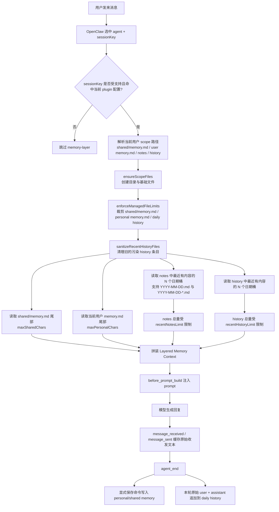

# Memory Layer 架构说明

本文档面向维护者以及未来接手 `memory-layer` 的 AI，重点记录“为什么这样设计”以及“出问题时该从哪里查”。

用户侧用法、安装示例和配置说明请优先查看 [README.md](C:\Users\zhenhuaixiu\.openclaw\extensions\memory-layer\README.md)。

## 设计目标

在不要求“每个终端用户对应一个 Agent”或“每个终端用户对应一个 workspace”的前提下，为多用户 OpenClaw Agent 提供分层记忆能力。

希望达成的行为：

- 旧的共享记忆仍然可读，用于兼容
- 新的共享记忆单独存储
- 新的个人记忆按用户隔离
- 私聊会话绝不把新的个人记忆写回共享的旧版记忆文件

## 非目标

以下内容不是当前插件的目标：

- 不尝试改造所有旧版 OpenClaw memory 行为
- 不替代 OpenClaw 的所有 bootstrap 逻辑
- 不在 `session.dmScope = "main"` 下提供真实的按用户隔离；该模式只会退化成单用户 fallback
- 不依赖特定渠道私有元数据来识别用户

## 当前有效召回层次

对于由插件接管的私聊会话，当前有效召回上下文按顺序可理解为：

1. workspace 根目录 `MEMORY.md` 中的旧版共享兼容记忆
2. `.memory-layer/shared/memory.md` 中的新共享记忆
3. 当前用户的个人记忆 `.memory-layer/users/<channel>/<account>/<peer>/memory.md`
4. 当前用户重定向后的旧版日记 `.memory-layer/users/<...>/notes/YYYY-MM-DD.md`
5. 当前用户近期轮次历史 `.memory-layer/users/<...>/history/YYYY-MM-DD.md`

关键约束：

- 根目录 `MEMORY.md` 仅作为兼容/共享上下文
- 新的个人记忆绝不能再写回根目录 `MEMORY.md`
- 对于插件接管的私聊会话，`memory/YYYY-MM-DD.md` 不再是真实记忆来源

## 当前注入语义

- `shared/memory.md`、当前用户 `memory.md` 和兼容 `notes/` 采用 `new-session` 语义
- `history/` 采用 `archive-only` 语义
- 尊重用户的操作：用户主动执行 `/new`、`/reset` 时，会重新注入 shared/personal/notes，但不会带回 `history/`
- 只有自动归档后新开的 session，才会恢复 `history/`
- 如果当前 session 刚写入了 shared/personal memory，下一轮会补注入一次 layered context，但不带 `history/`

## 加载流程图

下面这张图描述的是“一个用户进入私聊后，这次请求最终会带上哪些记忆上下文，以及它们是怎样被裁剪的”。

## 当前使用的 Hook

插件目前使用四个 Hook：

- `before_prompt_build`
  把分层记忆上下文注入到 prompt。
- `before_tool_call`
  重写旧版基于文件的记忆读写，并阻止无法按用户隔离的内置 memory 工具。
- `agent_end`
  记录当前用户近期历史，并处理显式保存命令。
- `message_received` / `message_sent`
  优先捕获原始入站与出站消息，避免把注入后的分层上下文重新写回 `history/`。

这意味着该插件本质上是一个 `hook-only` 插件，而不是注册 provider/channel/tool capability 的插件。

## 为什么要屏蔽内置 Memory 工具

OpenClaw 的旧版 memory 工具是围绕全局或共享记忆设计的：

- `memory_search` 会索引 `MEMORY.md` 与 `memory/**/*.md`
- `memory_get` 默认只读取旧版 memory 根目录，除非显式补充额外路径

这些工具不理解 `.memory-layer/users/...` 这种按用户隔离的目录结构。如果继续在插件接管的私聊会话中启用它们，就会重新引入不同用户之间的记忆混写。

因此当前设计明确规定：

- 屏蔽 `memory_search`
- 屏蔽 `memory_get`
- 正常召回依赖 prompt 中注入的分层记忆上下文
- 如确有必要，允许直接读取 `.memory-layer/...` 文件

这是隔离策略的一部分，不是 bug。

## 旧版路径重写规则

在由插件接管的私聊会话中，旧版 memory 路径会被改写如下：

- `read MEMORY.md` -> 当前用户的 `.memory-layer/.../memory.md`
- `read memory.md` -> 当前用户的 `.memory-layer/.../memory.md`
- `write/edit MEMORY.md` -> 当前用户的 `.memory-layer/.../memory.md`
- `write/edit memory.md` -> 当前用户的 `.memory-layer/.../memory.md`
- `read memory/YYYY-MM-DD.md` -> 当前用户的 `.memory-layer/.../notes/YYYY-MM-DD.md`
- `write/edit memory/YYYY-MM-DD.md` -> 当前用户的 `.memory-layer/.../notes/YYYY-MM-DD.md`
- `read memory/YYYY-MM-DD-*.md` -> 当前用户的 `.memory-layer/.../notes/YYYY-MM-DD-*.md`
- `write/edit memory/YYYY-MM-DD-*.md` -> 当前用户的 `.memory-layer/.../notes/YYYY-MM-DD-*.md`

目的有两个：

- 尽量兼容旧 Agent 已经形成的 `read` / `write` 习惯
- 防止新的个人记忆回流到共享旧文件

## Session Scope 识别规则

当前支持的私聊 key 形态包括：

- `agent:<agentId>:dm:<peerId>`
- `agent:<agentId>:<channel>:dm:<peerId>`
- `agent:<agentId>:<channel>:<accountId>:dm:<peerId>`
- `agent:<agentId>:<channel>:direct:<peerId>`

当前也可以识别部分群聊/频道/线程范围，但默认不处理，除非启用 `includeGroups`。

重要限制：

- `session.dmScope = "main"` 仍可运行，但只会退化成单用户模式，因为这种模式会把所有私聊折叠成同一个 session key，插件只能落到同一个用户目录中

## 运行时前置要求

为了避免旧逻辑绕过插件继续写入共享路径，强烈建议禁用内置的 `session-memory`。当前实现会在插件启动时对该冲突输出 warning，方便尽早发现配置问题。

当前本地配置已在以下文件中关闭：

- `.openclaw\openclaw.json`

关键配置项为：

- `hooks.internal.entries.session-memory.enabled = false`

## 常见排查顺序

当你排查“为什么记忆写到了错误的位置”时，建议按下面顺序检查：

1. 当前 session key 是否是受支持的私聊形态？
2. 插件是否加载成功？
3. `session-memory` 是否确实已禁用？
4. 当前会话是否命中了 `enabledAgents` / `enabledChannels` 的限制？
5. Agent 用的是旧版 `read/write` 工具，还是被屏蔽的 `memory_search/memory_get`？
6. 用户消息里是否真的包含显式保存命令，而不只是普通对话？

## 文件增长控制

插件目前对自己直接维护的 3 类文件增加了软上限控制：

- `shared/memory.md`
- 每个用户的 `memory.md`
- 每个用户每日 `history/YYYY-MM-DD.md`

对应配置项为：

- `maxStoredSharedChars`
- `maxStoredPersonalChars`
- `maxStoredHistoryChars`

这些上限用于避免插件自管文件无限增长，但它们不是 OpenClaw 原生 memory compaction 的一部分。

注意：

- `.memory-layer/**` 不会自动享受 OpenClaw 针对根目录 `MEMORY.md` / `memory/*.md` 的原生 memory flush 与索引维护
- `notes/` 文件主要是旧路径兼容层，读取时支持 `YYYY-MM-DD.md` 与 `YYYY-MM-DD-*.md`
- 兼容层可能因旧版 `read memory/...` 调用预创建空文件，但最近日期桶的召回选择会优先按“是否有真实内容”过滤，不再让空文件占坑

## 测试清单

改动后建议进行以下手工验证：

1. 重启 gateway。
2. 在私聊中让 Agent 记住一个个人事实。
3. 确认 workspace 根目录 `MEMORY.md` 没有新增个人事实。
4. 确认该事实出现在 `.memory-layer/users/.../memory.md`。
5. 在同一个私聊中要求回忆，并确认能正确召回。
6. 换另一个用户、另一个账号或另一个会话测试，并确认隔离正常。
7. 测试共享记忆保存行为，并确认它写入 `.memory-layer/shared/memory.md` 或自定义 `sharedFilePath`。

## 共享文件路径说明

- 共享层唯一规范文件是 `.memory-layer/shared/memory.md`（除非显式配置 `sharedFilePath` 覆盖）

## 已知权衡

在普通私聊会话里，根目录 `MEMORY.md` 中的旧版共享知识仍会被 OpenClaw 的 bootstrap 自动加载。这是为了兼容性而保留的行为。

这意味着：

- 旧共享知识仍然会继续参与上下文
- 插件能阻止新的个人记忆继续写回旧共享文件
- 但插件本身并没有完全移除 bootstrap 对旧共享记忆的读取

如果未来希望彻底移除这最后一层旧版共享记忆，那么不仅要替换或改写工具调用逻辑，还必须一并处理 bootstrap 行为本身。

## 维护建议

- 用户侧说明尽量放在 `README.md` / `README-en.md`
- 内部重写规则、兼容原因和排查策略放在本文件
- 如果以后新增 capability 注册、上下文引擎或更深的 OpenClaw 集成，优先在本文件补充“设计原因”，而不只是记录“代码现状”
